# Nexus LMS — Admin Panel

Admin Panel (back-office) untuk **Learning Management System**. Dikembangkan sebagai Tugas 1 mata kuliah **Pemrograman Web 2 (Client-Side Programming)**.

Aplikasi berjalan sepenuhnya di sisi klien (HTML5, CSS3/Tailwind, JavaScript). Data disimpan lokal di browser melalui lapisan service yang nantinya bisa diganti ke database online tanpa mengubah halaman.

> **Status:** v1.2.1 — seluruh halaman berfungsi dengan data lokal; tampilan kartu bergambar; lolos QA: HTML valid, Lighthouse 98–100, axe-core 0 pelanggaran, CSP aktif, teruji di Edge/Chrome/Firefox (57 uji unit, 99 uji E2E).

**🔗 Demo langsung:** https://fahrizal-tech.github.io/PEMPROGRAMAN-WEB2/ — masuk dengan `admin@nexus.ac.id` / `nexus2026` (lihat [Akun demo](#menjalankan-secara-lokal)).

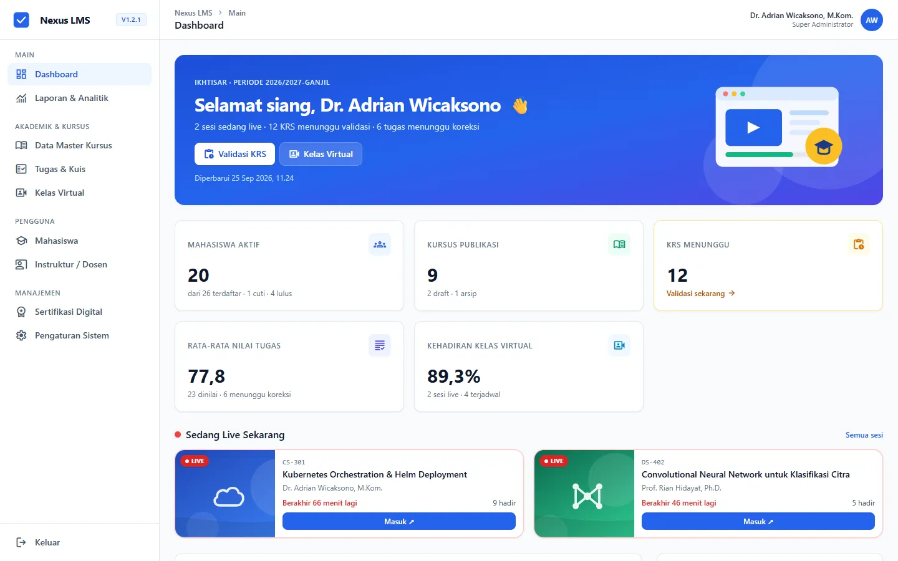

## Fitur Utama

| Modul | Halaman | Ringkasan |
| --- | --- | --- |
| Portal Login | `index.html` | Login demo, validasi, pembatasan percobaan, sesi |
| Dashboard | `pages/dashboard.html` | Banner ringkasan hari ini, 5 KPI, sesi live, 3 grafik Chart.js, aktivitas terbaru, kursus teratas |
| Data Master Kursus | `pages/data-master.html` | Katalog kartu bersampul ⇄ tabel: cari/filter/urut, Tambah/Edit/Hapus berpenjelasan, ekspor CSV |
| Form Kursus | `pages/form.html` | Tambah/edit kursus + sampul (otomatis/unggah) + struktur modul, validasi per kolom |
| Laporan & Analitik | `pages/laporan.html` | Rekap akademik, log aktivitas, ekspor CSV, cetak A4/PDF |
| Mahasiswa | `pages/mahasiswa.html` | CRUD mahasiswa, antrean validasi KRS, deteksi perlu perhatian |
| Instruktur | `pages/instruktur.html` | CRUD dosen, beban mengajar (BKD), EDOM, Serdos |
| Kelas Virtual | `pages/kelas-virtual.html` | Kartu sesi (live/akan datang/selesai) + hitung mundur, jadwal, presensi mahasiswa |
| Tugas & Kuis | `pages/tugas-kuis.html` | Asesmen per kursus (bobot ≤ 100%), penilaian, ekspor nilai |
| Sertifikasi | `pages/sertifikasi.html` | Terbit/TTE/cabut sertifikat, verifikasi nomor, cetak sertifikat |
| Pengaturan | `pages/pengaturan.html` | Profil institusi, akademik, sesi, akun admin, cadangan/pulihkan/reset data |

## Tangkapan Layar

| | |
| --- | --- |
| 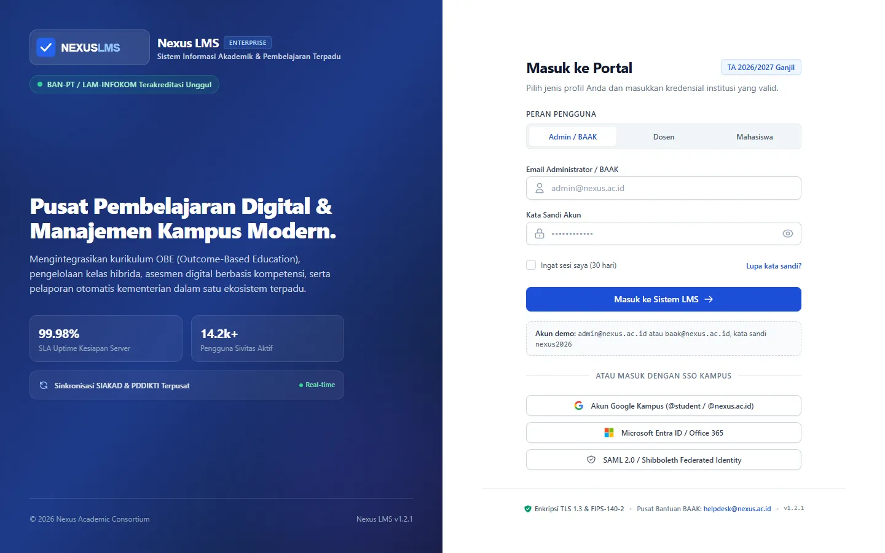 **Portal Login** | 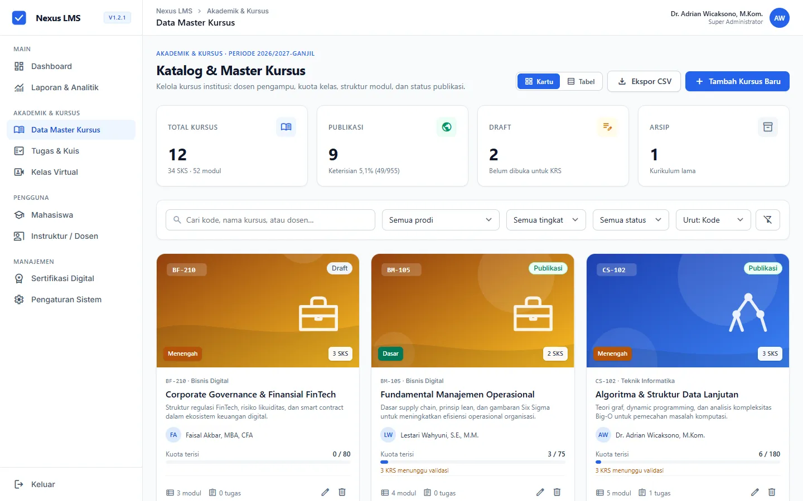 **Katalog Kursus** (kartu ⇄ tabel) |
| 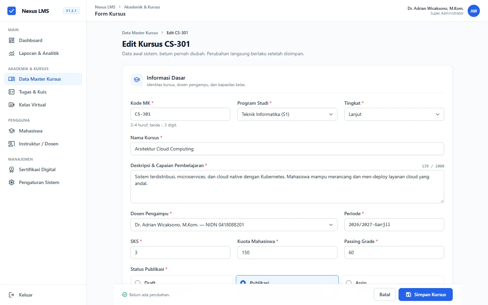 **Form Kursus** + struktur modul | 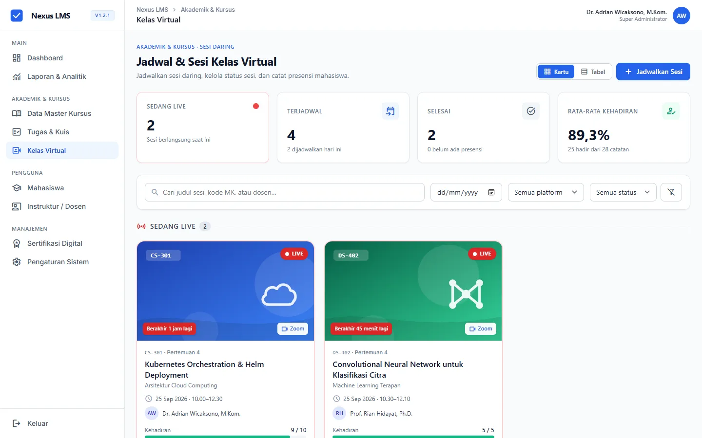 **Kelas Virtual** (live, hitung mundur) |
| 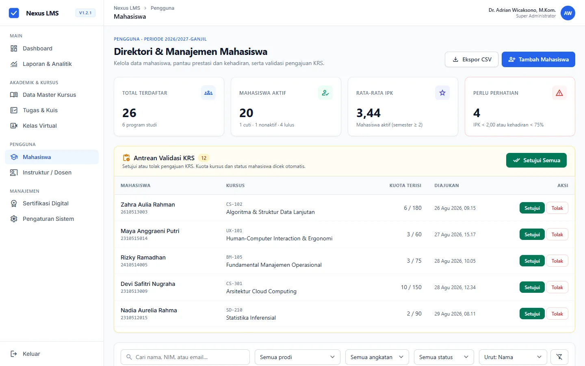 **Mahasiswa** + antrean validasi KRS | 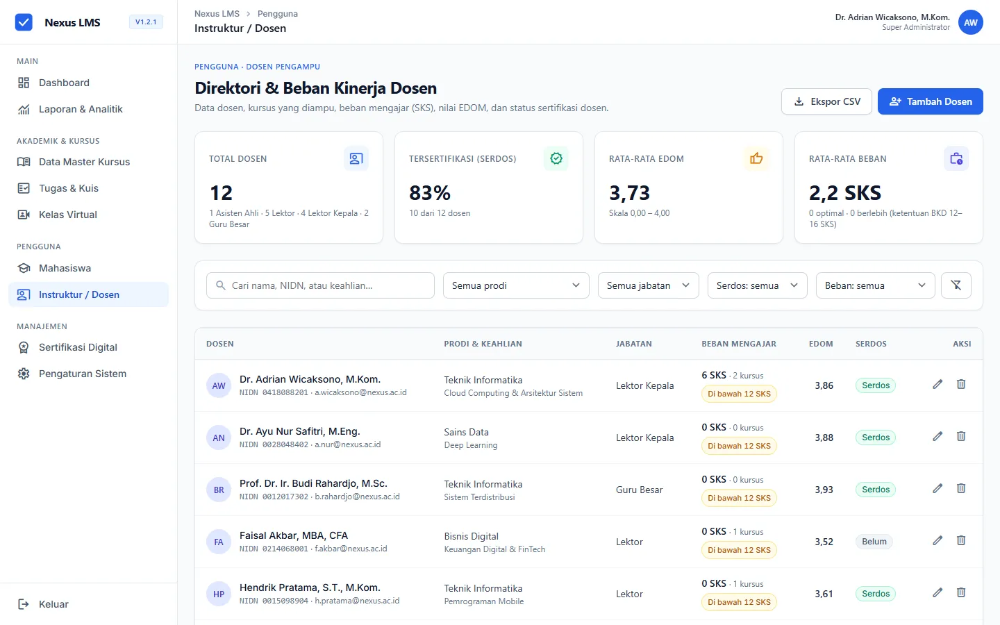 **Instruktur / Dosen** (BKD, EDOM) |
| 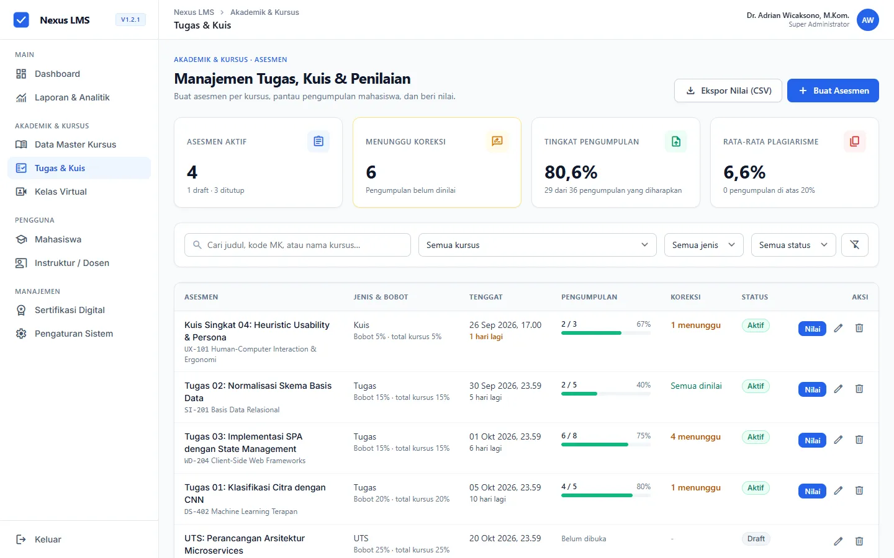 **Tugas & Kuis** | 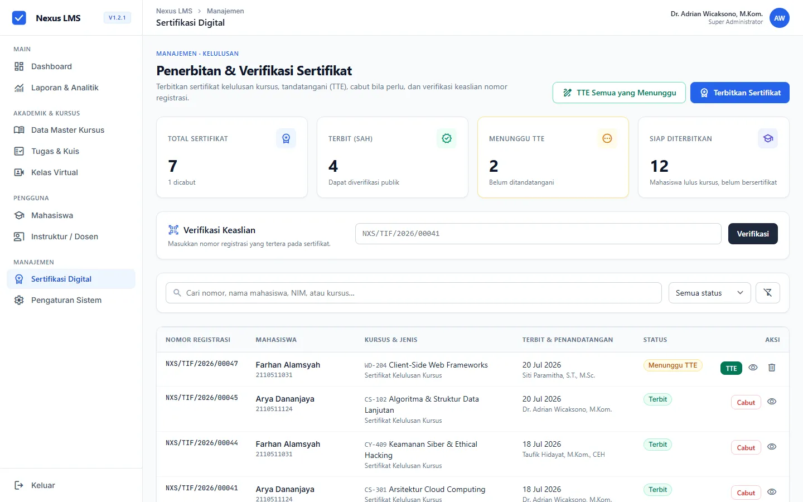 **Sertifikasi Digital** |
| 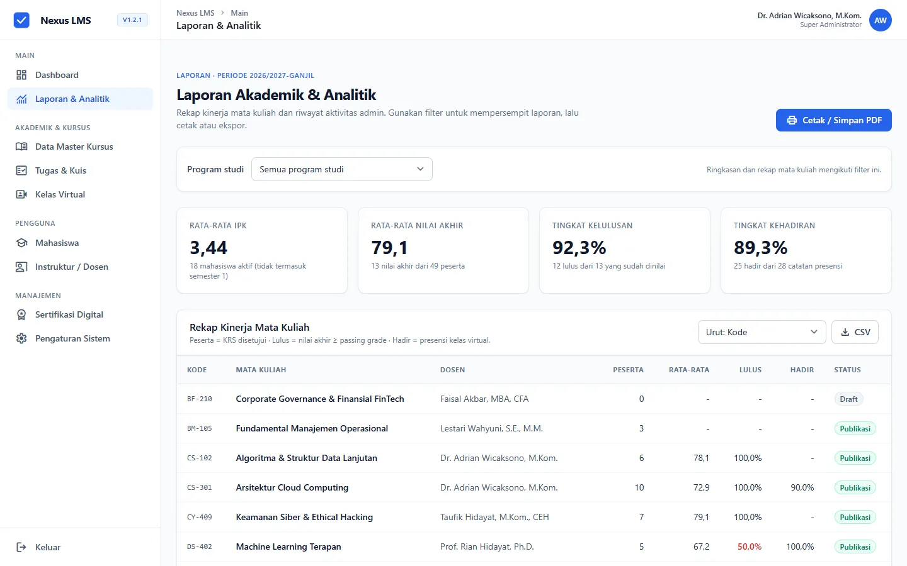 **Laporan & Analitik** (CSV, cetak A4) | 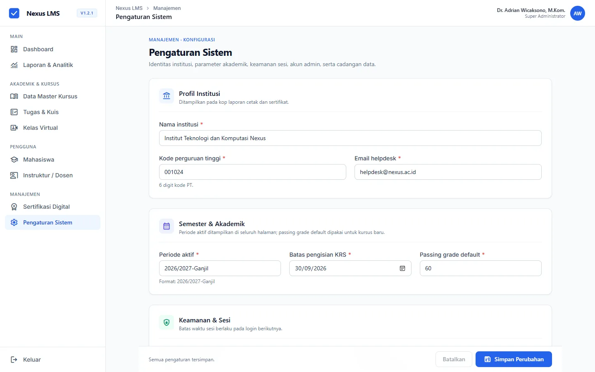 **Pengaturan Sistem** |

**Responsif (HP 390px):**

<p>
  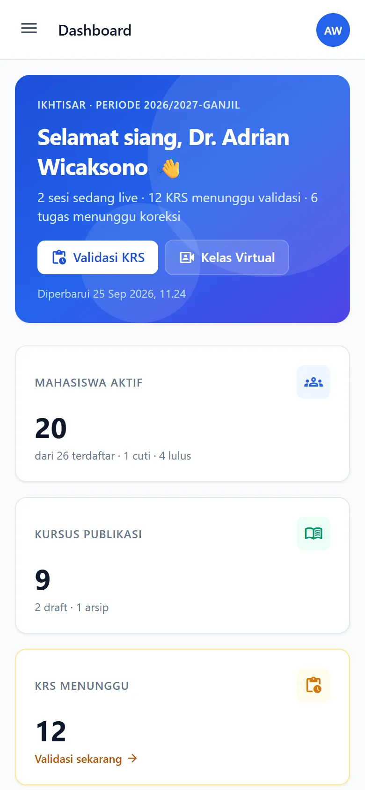
  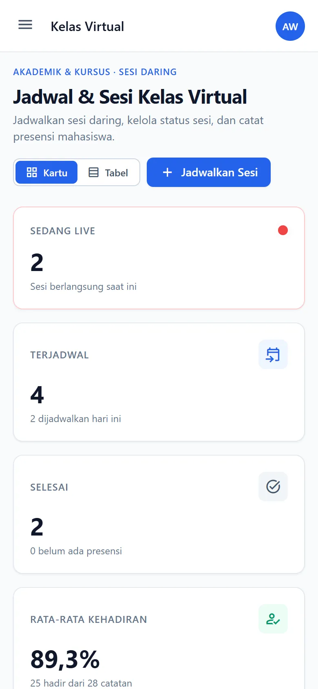
  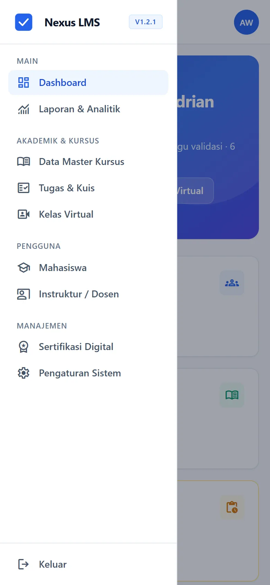
</p>

## Desain

- **Tema visual:** Material Design, diterapkan lewat design system *Academic Admin Studio* ([spesifikasi](docs/design-system-stitch.md))
- **Tools:** Google Stitch (wireframe & UI), Figma ([desain awal](https://www.figma.com/design/7aUyoUDLLLjVhcwW6yczcT/LMS-Admin-Panel?node-id=2-112&t=kEYvoVaPdIVuAusP-1))
- **Dokumen perancangan:** [docs/perancangan.md](docs/perancangan.md)

## Struktur Direktori

```text
├── docs/
│   ├── perancangan.md          # Milestone 1: menu, ER-D, user flow, design system
│   ├── roadmap.md              # Rencana & checklist pengembangan
│   ├── design-system-stitch.md # Token desain dari Stitch
│   ├── naskah-demo.md          # Naskah presentasi/demo 5–7 menit
│   └── img/                    # Rancangan (Stitch & Figma) + screenshot aplikasi
├── assets/
│   ├── css/                    # Tailwind (src/) & hasil build app.css
│   ├── js/                     # core/ (storage, service, auth), components/ (UI, layout), pages/
│   ├── vendor/                 # Chart.js (lokal, tanpa CDN)
│   ├── img/                    # Logo & gambar
│   └── data/                   # Seed data (mock database)
├── pages/                      # Halaman admin panel
├── tests/                      # unit/ (Node), e2e/ (browser), quality/ (HTML, a11y, Lighthouse)
├── index.html                  # Halaman Login
├── .github/                    # CI: pengujian & pemindai rahasia, Dependabot
├── CHANGELOG.md
├── SECURITY.md
└── README.md
```

## Menjalankan Secara Lokal

Tidak perlu instalasi. Cukup buka `index.html` di browser (klik dua kali), lalu masuk dengan akun demo:

| Email | Kata sandi | Peran |
| --- | --- | --- |
| `admin@nexus.ac.id` | `nexus2026` | Super Administrator |
| `baak@nexus.ac.id` | `nexus2026` | Admin Akademik (BAAK) |

> Login pada versi ini adalah **simulasi** (aplikasi berjalan sepenuhnya di browser), lihat [SECURITY.md](SECURITY.md). Data tersimpan di localStorage browser dan dapat dikembalikan ke kondisi awal dari halaman Pengaturan.
Semua halaman memakai CSS yang sudah di-build (`assets/css/app.css`) dan JavaScript biasa, sehingga bisa berjalan tanpa server.

Jika ingin memakai server lokal (misalnya untuk demo):
```bash
npm run serve        # lalu buka http://localhost:3000
```

### Menjalankan pengujian
```bash
npm test             # uji unit: data, storage, service, auth, utilitas
npm run test:e2e     # uji alur di browser (memakai Edge/Chrome yang terpasang)
npm run test:e2e -- --online   # uji yang sama ke website di GitHub Pages
npm run test:e2e -- --http     # lewat server HTTP lokal (wajib untuk Firefox: BROWSER_PATH=.../firefox.exe)

# Kualitas (Tahap 5)
npm run test:html        # validasi HTML: file mentah + DOM hasil render
npm run test:a11y        # aksesibilitas: axe-core WCAG 2.1 AA + uji keyboard
npm run test:lighthouse  # Lighthouse semua halaman (tambah -- --desktop / -- --detail)
```

### Build ulang CSS (hanya jika mengubah class Tailwind)
```bash
npm install
npm run build:css    # sekali build
npm run watch:css    # build otomatis saat file berubah
```

## Teknologi

- HTML5 semantik
- Tailwind CSS 3 (build via CLI, token dari design system Stitch)
- JavaScript (vanilla, tanpa framework)
- Chart.js
- Material Symbols & font Inter

---
Dibuat untuk keperluan tugas perkuliahan Pemrograman Web 2.
