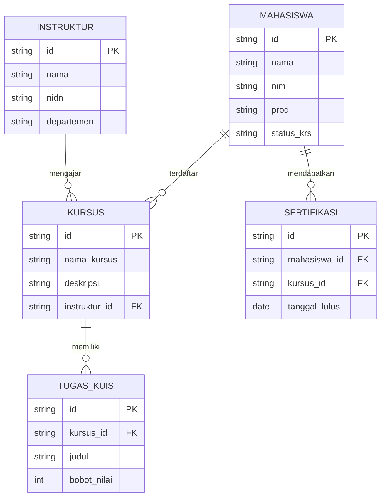

# Perancangan Admin Panel LMS (Nexus LMS Enterprise)

## 1. Hirarki Menu (Sidebar)
Berdasarkan hasil desain UI (Stitch LMS Front-End Admin Panel), sistem ini mencakup hierarki menu dan fitur komprehensif berikut:

- **Portal Akses**
  - Portal Login Mandiri Terpadu (`index.html`)
- **Dashboard & Analitik** (`pages/dashboard.html`)
  - Ringkasan Statistik
- **Manajemen Pengguna (Pengguna Akademik)**
  - Mahasiswa / Siswa (`pages/mahasiswa.html`)
    - *Fitur: Modal Edit Data, Validasi KRS*
  - Instruktur / Dosen (`pages/instruktur.html`)
- **Manajemen Pembelajaran**
  - Kelas Virtual (`pages/kelas-virtual.html`)
  - Manajemen Kurikulum / Form Kursus (`pages/form.html`)
    - *Fitur: Form Kursus Terintegrasi*
- **Evaluasi & Penilaian**
  - Tugas & Kuis (`pages/tugas-kuis.html`)
    - *Fitur: State Penilaian, Rubrik, dan CRUD Tugas*
- **Prestasi & Kelulusan**
  - Sertifikasi Digital (`pages/sertifikasi.html`)
- **Konfigurasi**
  - Pengaturan Sistem (`pages/pengaturan.html`)

## 2. Konsep ER-D Sederhana (Mock Data)
Walaupun berbasis *Client-Side Programming* (tanpa DB backend langsung), ini arsitektur relasi entitas untuk diolah melalui Object/Array JavaScript:

## 3. Konsep & Desain UI (Berdasarkan Referensi Stitch)
Rancangan UI menggunakan standar **Material Design / Enterprise UI** yang berfokus pada:
- **Clean Interface**: Menggunakan whitespace yang rapi dan kartu bayangan (subtle shadows) berwarna putih bersih.
- **Interaktivitas Lanjut**: Form *State Modal*, *Validasi Inline*, dan elemen *CRUD* yang interaktif.
- **Tata Letak**: Sidebar navigasi, Header, dan Area Konten Dinamis yang responsif.
