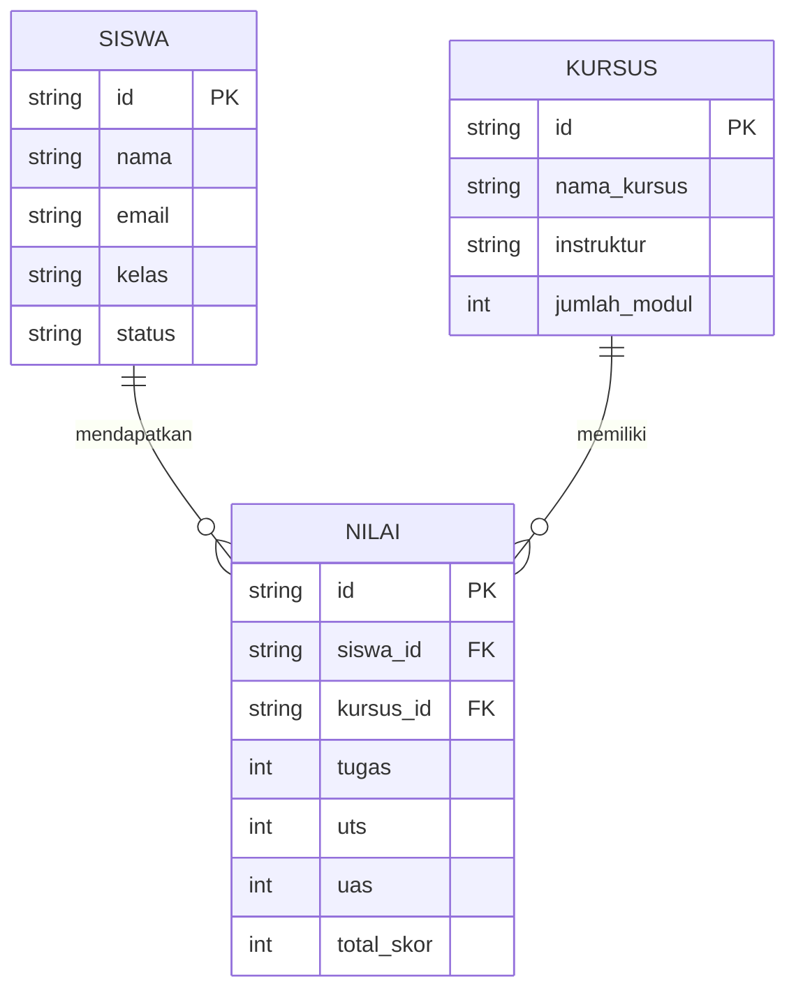

# Perancangan Admin Panel LMS (Learning Management System)

## 1. Hirarki Menu (Sidebar)
Sistem Admin Panel LMS ini memiliki rancangan hirarki menu sebagai berikut:

- **Login / Halaman Utama** (`index.html`)
- **Dashboard** (`pages/dashboard.html`)
  - Ringkasan Statistik Siswa, Kursus, & Pendaftaran
  - Grafik Aktivitas Belajar
- **Data Master**
  - Data Siswa (`pages/data-master.html`)
  - Kelola Kursus (Modul & Instruktur)
- **Form Input**
  - Tambah / Edit Siswa (`pages/form.html`)
- **Laporan**
  - Laporan Nilai Akademik (`pages/laporan.html`)

## 2. Konsep ER-D Sederhana (Mock Data)
Walaupun proyek ini murni berfokus pada *Client-Side Programming* tanpa database relasional backend, di bawah ini adalah konsep ER-D untuk menggambarkan aliran arsitektur data mock-up yang diolah menggunakan JavaScript:

## 3. Konsep & Desain UI (Wireframing & High-Fidelity)
Untuk memenuhi *Milestone 1* dan standar estetika, kami memilih **Material Design** dengan karakteristik *clean layout*, bayangan (*subtle shadows*), kartu (cards) berwarna putih bersih, dan tata letak grid/flexbox yang responsif.
Warna primer yang digunakan adalah **Education Blue** dipadu dengan aksen **Amber/Orange**.

**Link Publik Figma:** [LMS Admin Panel - Figma](https://www.figma.com/design/7aUyoUDLLLjVhcwW6yczcT/LMS-Admin-Panel?node-id=2-112&t=kEYvoVaPdIVuAusP-1)

Desain UI (High-Fidelity) dari halaman Dashboard dan Data Master yang menggunakan Material Design:

### 1. Dashboard UI

### 2. Data Master (Siswa) UI

### 3. Form Input Siswa UI

### 4. Kelola Kursus UI

### 5. Laporan Nilai UI

### 6. Pengaturan UI

*(Catatan: Gambar di atas adalah referensi desain yang digenerate sebagai pengganti rancangan manual)*
