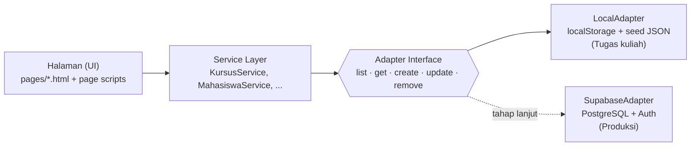

# Roadmap Pengembangan — Nexus LMS Admin Panel

Dokumen ini adalah rencana kerja resmi proyek. Isinya: strategi, tahapan, aturan kerja, dan checklist progres.
Setiap tahap dikerjakan di branch sendiri, direview, lalu di-merge ke `main`. Riwayat perubahan dicatat di [`CHANGELOG.md`](../CHANGELOG.md).

| Info | Keterangan |
| --- | --- |
| Mata kuliah | Pemrograman Web 2 (Client-Side Programming) |
| Topik | Learning Management System (LMS) |
| Tema visual | **Material Design** (implementasi via design system *Academic Admin Studio* dari Stitch) |
| Teknologi | HTML5, Tailwind CSS, JavaScript (ES Modules), Chart.js |
| Penyimpanan data | Lokal di browser (localStorage), bisa diganti ke database online |
| Hosting | GitHub Pages → custom domain |

---

## 1. Strategi Utama

### 1.1 Kesesuaian dengan ketentuan dosen

Ketentuan tugas: *client-side only, tanpa back-end, mock data*. Supaya ketentuan ini terpenuhi tanpa menutup jalan ke database sungguhan nanti, aplikasi dibagi menjadi tiga lapisan:



- **UI tidak pernah mengakses penyimpanan secara langsung.** Semua lewat service.
- **Semua method service bersifat `async` (Promise) sejak awal.** Saat pindah ke database online, kode halaman tidak perlu diubah.
- **Data awal (seed)** disimpan di `assets/data/*.json` dengan struktur yang sama persis seperti ER-D di [`perancangan.md`](perancangan.md).

### 1.2 Pemetaan ke kriteria penilaian

| Kriteria (bobot) | Strategi pemenuhan | Tahap |
| --- | --- | --- |
| Milestone 1 — Dokumentasi (20%) | Hirarki menu, ER-D Mermaid lengkap, User Flow, Design System, screenshot Stitch | 1 |
| Kualitas HTML & CSS (30%) | Tag semantik, Tailwind build + token design system, komponen sidebar/header tunggal, responsif 360–1920px | 2, 5 |
| Interaktivitas JS (20%) | Sidebar toggle, modal, validasi real-time, Chart.js, CRUD tabel, toast | 3, 4 |
| Kesesuaian UI/UX topik (20%) | Tabel akademik padat & terbaca, status KRS/nilai, dashboard analitik pembelajaran | 4 |
| Presentasi (10%) | Akun demo, data contoh realistis, naskah demo | 6 |

---

## 2. Aturan Kerja

### 2.1 Alur Git

```
main  ──●────────●────────●────────●──────▶   (selalu stabil & siap demo)
         \      /  \      /  \      /
          tahap-0    tahap-1    tahap-2 ...    (branch per tahap / fitur)
```

- Nama branch: `chore/tahap-0-fondasi`, `docs/tahap-1-perancangan`, `feat/tahap-2-layout`, `feat/tahap-3-data-layer`, `feat/tahap-4-<modul>`.
- Pesan commit memakai **Conventional Commits** dalam Bahasa Indonesia:
  `feat:` fitur · `fix:` perbaikan · `docs:` dokumentasi · `style:` tampilan · `refactor:` · `chore:` perawatan.
- Tag rilis per milestone: `v0.1.0` (M1), `v0.2.0` (M2), `v1.0.0` (M3, siap demo).

### 2.2 Definition of Done (berlaku untuk setiap fitur)

- [ ] Tampil benar di mobile (360px), tablet (768px), dan desktop (1280px+)
- [ ] Punya tampilan kosong (*empty state*), sedang memuat (*loading*), dan error bila relevan
- [ ] Tidak ada error di console browser
- [ ] Input tervalidasi, dan pesan error jelas dalam Bahasa Indonesia
- [ ] Bisa dipakai dengan keyboard (fokus terlihat, label terhubung ke input)
- [ ] Tercatat di `CHANGELOG.md`

### 2.3 Keamanan (repo publik)

Repo ini publik, jadi **semua isi file dan seluruh riwayat commit bisa dibaca siapa pun.** Aturan yang berlaku:

| Aturan | Cara penerapan |
| --- | --- |
| Tidak ada rahasia (API key, token, password) di repo | `.gitignore` memblokir `.env`, `*.key`, `credentials*.json`; workflow **Secret Scan (Gitleaks)** memeriksa setiap push |
| Email pribadi tidak terekspos di commit | Commit memakai email *noreply* GitHub (`…@users.noreply.github.com`) |
| Hanya data fiktif | Seed data memakai nama & domain fiktif (`@nexus.ac.id`), bukan data mahasiswa sungguhan |
| Aman dari XSS | Input pengguna dirender via `textContent`/escape, bukan `innerHTML` mentah |
| Minim pihak ketiga | Aset (avatar, CSS) di-host sendiri; CDN yang tersisa memakai versi terkunci |
| Login demo bukan pengaman | Dinyatakan jelas di [`SECURITY.md`](../SECURITY.md); autentikasi sungguhan di Tahap 7 |

---

## 3. Tahapan & Checklist

### Tahap 0 — Fondasi & Kerapian Repo ✅
- [x] Snapshot hasil ekspor Stitch masuk ke riwayat git
- [x] Hapus versi lama (multi-page `style.css` & SPA), arsipkan backup di luar repo
- [x] Hapus worktree `.kilo` yang tidak terpakai
- [x] Impor halaman Stitch yang belum ada: Dashboard, Data Master Kursus, Laporan/Analitik
- [x] Standarisasi nama file sesuai format dosen (`kurikulum.html` → `form.html`)
- [x] Screenshot Stitch dikompres ke WebP (7,4 MB → 1,8 MB) → `docs/img/stitch/`, design system → `docs/design-system-stitch.md`, logo SVG → `assets/img/`
- [x] Audit keamanan riwayat git: tidak ada kredensial; email pribadi di metadata commit diganti email *noreply*
- [x] `SECURITY.md`, pola rahasia di `.gitignore`, workflow Secret Scan (Gitleaks)
- [x] `.gitignore`, `.gitattributes` (line ending LF), `.editorconfig`
- [x] Roadmap, README, CHANGELOG

### Tahap 1 — Milestone 1: Dokumentasi Perancangan (target: pekan 3) ✅
- [x] Hirarki menu final (diagram + peta halaman) dan keputusan atas 3 menu Stitch tanpa halaman
- [x] ER-D Mermaid lengkap, 14 entitas: `PROGRAM_STUDI`, `MAHASISWA`, `INSTRUKTUR`, `KURSUS`, `MODUL`, `KRS`, `KELAS_VIRTUAL`, `PRESENSI`, `TUGAS_KUIS`, `PENGUMPULAN`, `SERTIFIKAT`, `ADMIN`, `LOG_AKTIVITAS`, `PENGATURAN`
- [x] Kamus data (atribut, tipe, aturan validasi, contoh nilai) untuk tiap entitas
- [x] User Flow (Mermaid flowchart): login → dashboard → CRUD → laporan, plus aturan UX
- [x] Design System: penerapan Material Design, palet warna, tipografi, komponen reusable
- [x] Galeri rancangan Stitch + evolusi desain (wireframe → mid → high fidelity)
- [x] Rilis tag `v0.1.0`

### Tahap 2 — Milestone 2: Slicing & Layouting (target: pekan 5) ✅
- [x] Setup Tailwind CLI (`package.json`, `tailwind.config.js`) dengan token dari design system (48 warna, 13 ukuran font, 10 spasi, 17 font family); radius memakai standar Tailwind agar seragam
- [x] Hasil build CSS di-commit (`assets/css/app.css`, 61 KB minified) → hosting tetap statis tanpa build server
- [x] `pages/layout.html`: template master (`<aside>`, `<header>`, `<main>`, `<footer>`) + contoh komponen design system; diuji di 1280px, 390px, dan drawer terbuka
- [x] Komponen sidebar + topbar + footer tunggal (`assets/js/components/layout.js`): menu dari satu sumber data, breadcrumb, profil admin, skip link
- [x] Navigasi antarhalaman berfungsi di 11 halaman, penanda menu aktif otomatis
- [x] Sidebar sesuai hirarki final di `perancangan.md` (hapus Modul & Materi, Hak Akses & Peran, Keuangan & Transaksi), branding seragam
- [x] Sidebar responsif: drawer + overlay + tombol burger di < 1024px (tutup via overlay/Esc, scroll terkunci, `aria-expanded`)
- [x] Hapus Tailwind CDN & konfigurasi inline di setiap halaman (−1.700 baris), tombol aksi header dipindah ke konten
- [x] Ganti 20 gambar dari `lh3.googleusercontent.com` (link sementara Stitch) dengan logo lokal / avatar inisial / placeholder
- [x] Uji E2E otomatis 16/16 lulus (login, navigasi, drawer, responsif, tanpa error JS)
- [x] Rilis tag `v0.2.0`

### Tahap 3 — Data Layer Lokal ✅
- [x] `assets/js/core/storage.js`: LocalAdapter async (list/get/query/insert/update/remove, versi skema, reset, export/import, fallback memori, pemulihan data rusak, sinkron antar-tab)
- [x] Uji unit `npm test` (Node test runner): storage, seed, services, auth, utils — 50 uji
- [x] Uji E2E `npm run test:e2e` (puppeteer-core + browser terpasang, mode `--online`) — 21 uji
- [x] Rilis tag `v0.3.0`
- [x] Data awal `assets/data/seed.js` (14 entitas, 266 baris data fiktif; format JS agar jalan tanpa server; deterministik; divalidasi: 0 error relasi & duplikat)
- [x] Service per entitas + relasi (`services.js`): kursus ber-KRS aktif tidak bisa dihapus, kuota KRS, total bobot tugas ≤ 100%, syarat kelulusan sertifikat, hapus berantai (modul/tugas/kelas), dll.
- [x] `auth.js`: login admin demo (dikunci 30 detik setelah 5x gagal), sesi (ingat 30 hari / tutup browser, idle timeout dari pengaturan), *route guard* tanpa kilasan konten, anti open-redirect, logout; halaman login dengan validasi per kolom & tab peran
- [x] Pencatatan otomatis ke `LOG_AKTIVITAS` untuk setiap create/update/delete (+ aksi khusus: setujui/tolak KRS, beri nilai, terbit/cabut sertifikat)
- [x] Utilitas (`utils.js`): format tanggal/angka Indonesia, debounce, `escapeHTML`, ekspor CSV aman (anti formula injection)
- [x] Validasi & sanitasi data di service layer (`validators.js`, skema yang sama dipakai form) — uji unit total 41 lulus

### Tahap 4 — Milestone 3: Halaman & Interaktivitas (target: pekan 7) ✅
- [x] **Komponen bersama** (`assets/js/components/ui.js`): template HTML anti-XSS, badge status, toast, modal aksesibel (fokus terkunci, Esc), konfirmasi, hapus dengan penjelasan dampak/penghalang, form tervalidasi per kolom, tabel (cari, filter, urut, halaman, kosong/memuat). Etalase interaktif di `layout.html`.

**Halaman wajib:**
- [ ] `index.html` — Login: validasi, tampil/sembunyikan password, redirect ke dashboard; tab default Admin/BAAK, tab Dosen/Mahasiswa → pemberitahuan "di luar lingkup"
- [x] `dashboard.html` — 5 KPI dari data (KRS menunggu dapat diklik), 3 grafik Chart.js lokal (tren KRS, mahasiswa per prodi, keterisian kursus) + tabel data untuk pembaca layar, aktivitas terbaru, kursus teratas
- [x] `data-master.html` — KPI dari data, tabel kursus (kuota vs terisi, modul, tugas), cari/filter/urut/halaman, Edit/Hapus dengan konfirmasi berpenjelasan, ekspor CSV sesuai filter
- [x] `form.html` — form kursus mode tambah/edit (`?id=`), validasi per kolom, cek duplikat kode, struktur modul (tambah/urutkan/hapus), publikasi butuh modul, peringatan perubahan belum disimpan
- [x] `laporan.html` — KPI akademik (IPK, nilai, kelulusan, kehadiran) & rekap per mata kuliah dengan filter prodi; log aktivitas dengan cari/filter aksi/rentang tanggal; ekspor CSV; cetak A4 (`@media print`: kop laporan, semua baris log, tabel pas lebar kertas) / simpan PDF
- [x] Rilis tag `v0.4.0` (4 halaman wajib selesai)

**Halaman pendukung:**
- [x] `mahasiswa.html` — KPI (termasuk "perlu perhatian"), antrean validasi KRS (setujui/tolak beralasan/setujui semua dengan laporan), tabel + filter + ekspor CSV, tambah/edit di modal, detail KRS per mahasiswa, hapus berpenjelasan
- [x] `instruktur.html` — KPI (Serdos, EDOM, beban), tabel dengan beban mengajar BKD (di bawah 12 / optimal 12–16 / lebih dari 16 SKS), filter & ekspor CSV, tambah/edit di modal, detail kursus diampu, hapus berpenjelasan
- [x] `kelas-virtual.html` — KPI sesi, jadwal (live di atas), status terjadwal → live → selesai, presensi per sesi (hadir/izin/alpa, tandai semua), jadwalkan/edit sesi (modul menyesuaikan kursus, tautan wajib https), hapus
- [x] `tugas-kuis.html` — KPI (koreksi, pengumpulan, plagiarisme), tabel dengan tenggat & progres, buat/edit (sisa bobot kursus), penilaian per pengumpulan (terlambat, plagiarisme > 20%), ekspor nilai CSV
- [x] `sertifikasi.html` — KPI, verifikasi nomor registrasi, terbitkan hanya untuk yang lulus (nomor otomatis, penandatangan = dosen), TTE satuan/semua, cabut dengan konfirmasi, draf dapat dihapus (terbit tidak), pratinjau & cetak sertifikat
- [x] `pengaturan.html` — profil institusi, akademik, keamanan sesi (tervalidasi, hanya kolom berubah disimpan), daftar akun admin & peran, unduh/pulihkan cadangan JSON (tervalidasi), reset data (konfirmasi ketik RESET)
- [x] Rilis tag `v1.0.0` (seluruh halaman berfungsi)

### Tahap 4c — Penyegaran Visual (UI kartu bergambar)
Tujuan: tampilan lebih menarik (kartu bergambar ala katalog kursus) **tanpa mengubah logika/data**; semua uji lama harus tetap lulus. Dikerjakan sebelum QA agar QA menilai tampilan final.
- [x] 4c.1 Fondasi: sampul kursus otomatis (SVG: warna per prodi, ikon per topik), unggah sampul di Form Kursus (dikompres 16:9 WebP, hanya gambar), tombol Kartu ⇄ Tabel & mode kartu di `ui.dataTable`, ilustrasi tampilan kosong
- [x] 4c.2 Kelas Virtual: kartu per sesi (Sedang Live · Akan Datang · Selesai) dengan sampul, badge LIVE, hitung mundur (diperbarui tiap menit), platform, avatar dosen, bar kehadiran, aksi; tombol Kartu ⇄ Tabel
- [x] Data contoh v2: tanggal relatif terhadap hari ini (jadwal, tenggat, log selalu aktual saat demo); stempel waktu kejadian UTC, tanggal tampilan lokal (`u.localDate`)
- [ ] 4c.3 Katalog Kursus (Data Master) & Dashboard visual (banner sapaan, kartu sesi live, kursus teratas bergambar)
- [ ] 4c.4 Konsistensi, uji, screenshot review, rilis tag `v1.1.0`

### Tahap 5 — QA & Polesan
- [ ] Validasi HTML W3C tanpa error
- [ ] Lighthouse: Performance, Accessibility, Best Practices ≥ 90
- [ ] Uji lintas browser (Chrome, Firefox, Edge) & perangkat
- [ ] Cek aksesibilitas: kontras, `aria-*`, urutan fokus, `alt` gambar
- [ ] Hapus kode mati & data dummy yang tidak terpakai
- [ ] *Content-Security-Policy* via `<meta>`, `integrity` (SRI) pada CDN, `rel="noopener"` pada link eksternal
- [ ] Aktifkan Dependabot untuk dependency npm

### Tahap 6 — Deploy & Presentasi
- [ ] GitHub Pages aktif dari branch `main`
- [ ] README berisi screenshot, akun demo, link live
- [ ] Rilis tag `v1.0.0`
- [ ] Kirim link repository ke LMS Mentari
- [ ] Naskah demo 5–7 menit (alur: login → dashboard → CRUD → form → laporan → responsif)

### Tahap 7 — Pasca-Tugas: Menuju Produksi
- [ ] Skema SQL dari ER-D di Supabase (PostgreSQL) + Row Level Security
- [ ] `SupabaseAdapter` → ganti adapter lewat satu konfigurasi (hanya *anon key* di front-end; *service role key* tidak pernah di repo)
- [ ] Autentikasi sungguhan (Supabase Auth) menggantikan login demo
- [ ] Migrasi data seed ke database
- [ ] Custom domain (DNS CNAME) + HTTPS
